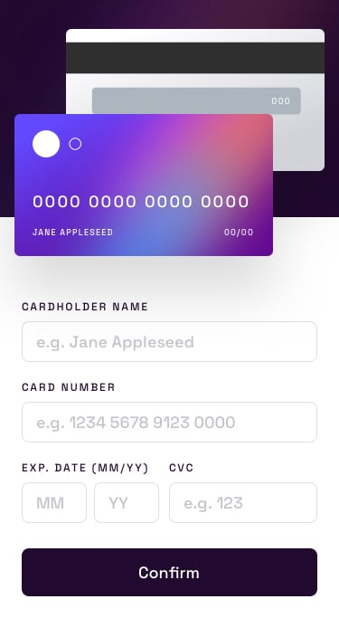

# Frontend Mentor - Interactive card details form solution

This is a solution to the [Interactive card details form challenge on Frontend Mentor](https://www.frontendmentor.io/challenges/interactive-card-details-form-XpS8cKZDWw). Frontend Mentor challenges help you improve your coding skills by building realistic projects. 

## Table of contents

- [Overview](#overview)
- [The challenge](#the-challenge)
- [Screenshot](#screenshot)
- [Links](#links)
- [Built with](#built-with)
- [Useful resources](#useful-resources)
- [Author](#author)
- [Acknowledgments](#acknowledgments)

**Note: Delete this note and update the table of contents based on what sections you keep.**

## Overview

### The challenge

Users should be able to:

- Fill in the form and see the card details update in real-time
- Receive error messages when the form is submitted if:
  - Any input field is empty
  - The card number, expiry date, or CVC fields are in the wrong format
- View the optimal layout depending on their device's screen size
- See hover, active, and focus states for interactive elements on the page

### Screenshot
### Mobile

#### Payment Done!

### Desktop

#### Payment Done!

#### Error Detaction!

### Links

- [Github](https://github.com/Have-Samuel/interactive-Card-Details)
- [Live Link](https://cc-kashata-d11e95.netlify.app/)

### Built with

- Semantic HTML5 markup
- CSS custom properties
- Flexbox
- Mobile-first workflow
- [jQuery](https://releases.jquery.com/) - JQuery library
- Javascript
- Git & Gitworkflow
- Positioning
- Best practices

### Useful resources

- [Code By code](https://www.youtube.com/playlist?list=PLK0Ff7cRiCMF2pU3MsZgTtyLoxF37kynS) - This helped me for the Card Number Building. I really liked this pattern and will use it going forward.

## Author

- [FrontendMentor](https://www.frontendmentor.io/profile/Have-Samuel)
- [Twitter](https://twitter.com/samhave1)
- [LinkedIn](https://www.linkedin.com/in/have-samuel/)

## 🤝 Contributing

Contributions, issues, and feature requests are welcome!

Feel free to check the [issues page](https://github.com/Have-Samuel/interactive-Card-Details/issues).

## Show your support

Give a ⭐️ if you like this project!
## Acknowledgments

- 🎉 Thanks to Frontend Mentor 
- 👋 Thumbs Up to [@Trekab](https://github.com/trekab)
- etc

## 📝 License

This project is [MIT](./MIT.md) licensed.
